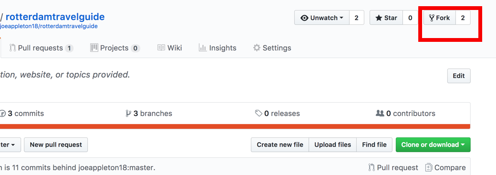

# Git Collaboration 

The purpose of this practical is to simulate how a collaborative git work flow would operate in the 'real word'.

Using your local knowledge you are going to create a visit Rotterdam Website. 


	
# Setup

We're going to use git to collaborate on this project. Firstly install git on your local computer:

[instructions can be found here](https://git-scm.com/book/en/v2/Getting-Started-Installing-Git)


Once installed if you are on a mac open up terminal, on windows open up git bash.  


### Set up your user details 

```
git config --global user.name "Your Name Comes Here"
git config --global user.email you@yourdomain.com
```

**You can check your config with**

You can check your configuration with:

``git config --list``


## Create a GitHub account

If you don't have one already set up a GitHub account at [github.com](http://www.github.com). 

- Use a real name, remember it's part of your professional profile


## Form Teams 


- Nominate a team leader **you can form one group or use smaller sub groups**. Ideally the team leader would have used git and gitHub before



- The team leader should fork the `rotterdamtravelguide` project. Doing this will copy the project across to their own GitHub account. 

- The team leader should then grant access to the repository to everyone else in the team. This can be done from the repository settings  


- Everyone in the team should then clone the team leaders repository to their local computer. 

-  
>> get the repository address by pressing the clone button 

  - Type `git clone <projectadress>` and press enter 
  - A new folder called `rotterdamtravelguide` should be created containing the starter project.
  - Type `cd rotterdamtravelguide` and press enter in order to navigate into that project folder. 
  

 
 # The Task 
 
  
 - As a team pick out one attraction each to write about. This can be anything that takes their fancy. 

 - Each team member should then create a new branch, so they can work on their attraction in isolation. To create a new branch type:

 ```
   git checkout -b "branch_name"
 
 ```
 >> Note, branch names can not contain spaces.
 
 - This will create a new branch and switch to it. If you type  `git branch` you should see you are on your relevant branch 

 - Updated the html pages relating to your chosen attraction.  
 	- Commit regularly 
 	
 	```
 	  git add -A
 	  git commit -m "this is a commit message"
 	```

   - If you make a mistake:

   ```
    git reset --hard
   		
   ```
   >> resets the head to the last commit 
   
 # Pull requests 
   
 - When each team member feels they have finished their section they should push their features branch to the github origin  origin 


 ```
   git push -u origin <the name of your branch>	
```

- The team member should then locate their branch on gitHub and raise a pull request.


- If the team leader is happy with the pull request, he should merge it into the project.

- The team member should switch back to the master branch and pull the latest changes:

``` 
git checkout master
git pull origin master

```


**If we have time, let's make a live website**

- Not only is GitHub great for collaborating, they'll also host your website for free! 

- Check out a new branch it must be called `gh-pages` 

- Push your new branch to the origin `git push -u origin gh-pages`

- That's it, your website should now be visible at:

   - `https://<username>.github.io/<repository name`>

   - Mine is `https://joeappleton18.github.io/rotterdamtravelguide`


